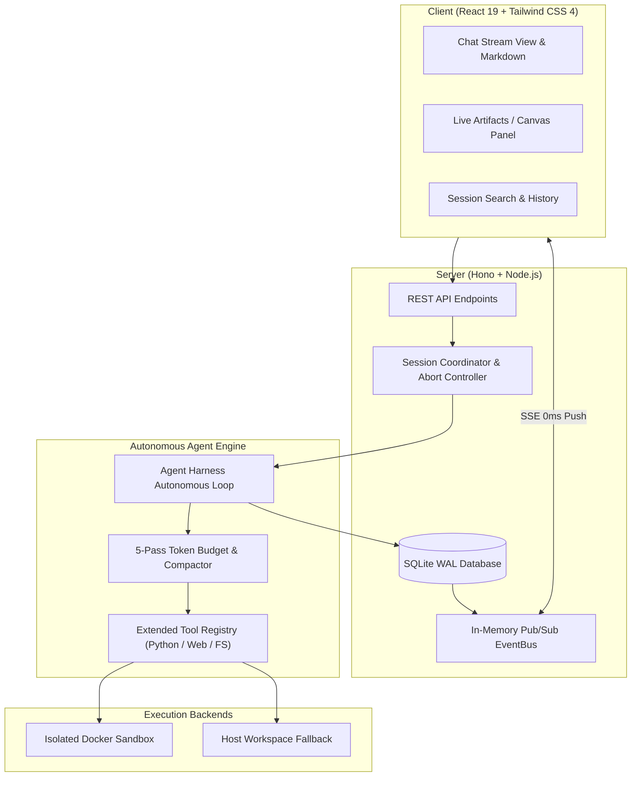

<div align="center">

# 🚀 OpenChat

**The Self-Hosted, Open-Source Alternative to ChatGPT & Claude**

*Full-stack autonomous AI assistant with 0ms real-time streaming, interactive Live Artifacts, advanced Code Interpreter, intelligent web search, and universal model gateway.*

<p align="center">
  <a href="https://github.com/smturtle2/open-chat/blob/main/LICENSE"></a>
  
  
  
  
  
  <a href="https://github.com/smturtle2/open-chat/pulls"></a>
</p>

</div>

---

## ⚡ 1-Minute Quick Start

Install or update OpenChat with a single universal command on **Linux** or **macOS**:

```bash
curl -fsSL https://raw.githubusercontent.com/smturtle2/open-chat/main/install.sh | bash
```

### 🚀 Starting OpenChat

Once installed, simply run `openchat` from any terminal:

```bash
openchat
```

Then open your browser at **`http://localhost:3000`**.

> **Note**: OpenChat is installed into `$HOME/.openchat/app` and creates a global launcher at `$HOME/.local/bin/openchat`. All user data, databases, and workspaces are safely stored in `$HOME/.openchat/` and preserved across updates.

---

## ✨ Key Features

| Feature | Description |
| :--- | :--- |
| ⚡ **0ms Real-Time Push Streaming** | High-performance in-memory EventBus architecture delivers instant thought (`<think>`) and token streaming without polling lag. |
| 🎨 **Live Artifacts & Canvas** | Interactive side panel for rendering and running HTML/JS apps, React components, SVG graphics, Mermaid diagrams, and formatted markdown documents. |
| 📊 **Data Analysis & Code Interpreter** | Built-in Python environment for computational processing, data analysis, and instant chart/graph visualization directly in chat. |
| 🔍 **Smart Document & Code Search** | Search through uploaded files and workspace documents with fast keyword and regex filters (`search_files`, `list_files`). |
| 🌐 **Stealth Web Search & Spider** | Anti-bot bypassing web scraper and spider crawler powered by **Scrapling** and DuckDuckGo for live internet knowledge. |
| 🔒 **Dual-Mode Sandbox Execution** | Switch seamlessly between disposable isolated Docker containers (**Chat Mode**) and local host workspace (**Agent Mode**). |
| 🧩 **Universal Model Gateway** | Connect with OpenAI, OpenRouter, OpenCode, Ollama, LocalAI, vLLM, or any custom OpenAI-compatible API endpoint. |
| 💾 **Markdown Export & Session Search** | One-click chat export to formatted `.md` files and instant search filtering across conversation histories. |
| 📱 **Mobile-First 60fps Gestures** | Vaul-inspired fluid touch drag-to-dismiss bottom sheets, responsive split-screen view, and dark/light/system themes. |

---

## 🏛 Architecture



---

## 🛠 Included Autonomous Tools

* **`search_files`**: Fast keyword and regex pattern search across workspace files and uploaded documents.
* **`list_files`**: Browse directory tree structures and inspect file sizes.
* **`python`**: Python 3 runtime for calculations, statistical modeling, and `matplotlib` chart creation.
* **`web_search`**: Live web search engine via DuckDuckGo.
* **`web_fetch`**: Single-page precision extractor powered by Scrapling (HTTP, Stealth, JS-dynamic engines).
* **`web_crawl`**: Multi-page recursive crawler and sitemap reader.
* **`read_file` / `write_file` / `patch_file`**: Surgical file viewing, creation, and precision replacement.
* **`view_image`**: Vision inspection for uploaded images and generated diagrams.
* **`load_skill`**: On-demand modular workflow loader supporting the [agentskills.io](https://agentskills.io) standard.

---

## 💻 Manual Setup

If you prefer installing manually from source:

```bash
# 1. Clone the repository
git clone https://github.com/smturtle2/open-chat.git ~/.openchat/app
cd ~/.openchat/app

# 2. Install dependencies & build frontend
npm install
npm run build

# 3. Configure environment (optional)
cp .env.example .env

# 4. Start the server
npm start
```

---

## ⚙️ Configuration (`.env`)

```ini
# Port to listen on (default: 3000)
PORT=3000

# Default Upstream Provider & Model
LLM_BASE_URL=https://opencode.ai/zen/go/v1
LLM_MODEL=muse-spark-1.2-contributor
LLM_API_KEY=your_api_key_here

# Thought retention strategy: "task" (recommended) or "all"
OPENCHAT_THOUGHT_RETENTION=task
```

> **Tip**: You can also configure multiple providers, test connection latency, and select custom models directly inside the **Settings** modal in the web interface.

---

## 🧪 Testing & Verification

```bash
# Run backend & context unit tests
npm run test:unit

# Run type checks
npm run typecheck
```

---

## 📄 License

OpenChat is open-sourced software licensed under the [MIT License](LICENSE).
